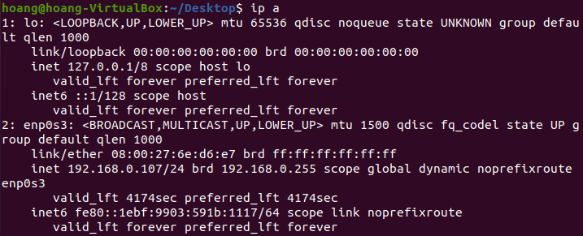
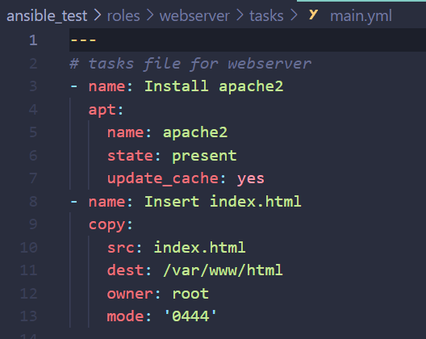

# Task 2: Ansible Test
Manage WebServers through Ansible

## Preparation

- 2 VMs can ping to each other

## Implementation

1. Prepare Webserver

    `IP: 192.168.0.107`

2. Install Ansible on host

    `python3 -m pip install --user ansible`
    `ansible --version`

3. Create inventory file with credentials

4. Create WEBSERVER INSTALLATION AND TESTING file (playbook file)

5. Config the webserver role in main.yml

6. Create index.html

7. Start the Ansible

## Troubleshooting

- Need to define the ansible_ssh_pass and ansible_ssh_user inside Inventory in order to connect to client

## Verification

