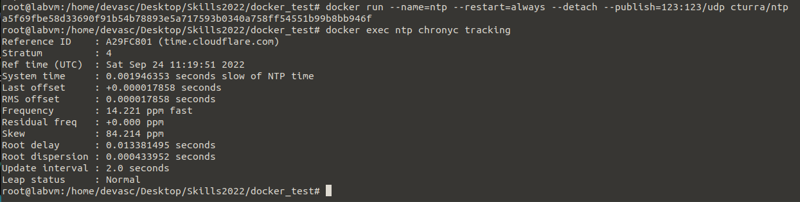
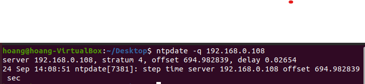

# Task 3: Docker Test
Manage Docker microservices

## Preparation

- 1 VM can connect to the internet as ntp server
- 1 VM as client which can ping to server

## Implementation

1. Pull the ntp service from dockerhub

    `docker pull cturra/ntp`

2. Publish the ntp service to LAN

    `docker run --name=ntp            \
              --restart=always      \
              --detach              \
              --publish=123:123/udp \
              cturra/ntp`
    
    

## Troubleshooting

- There is no problem

## Verification

    
