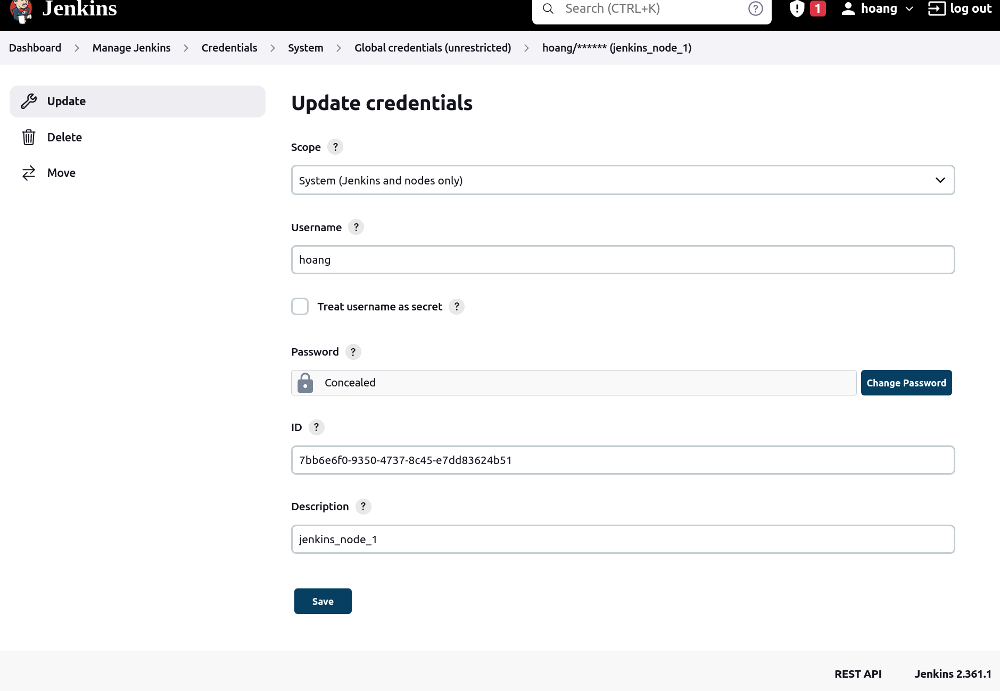
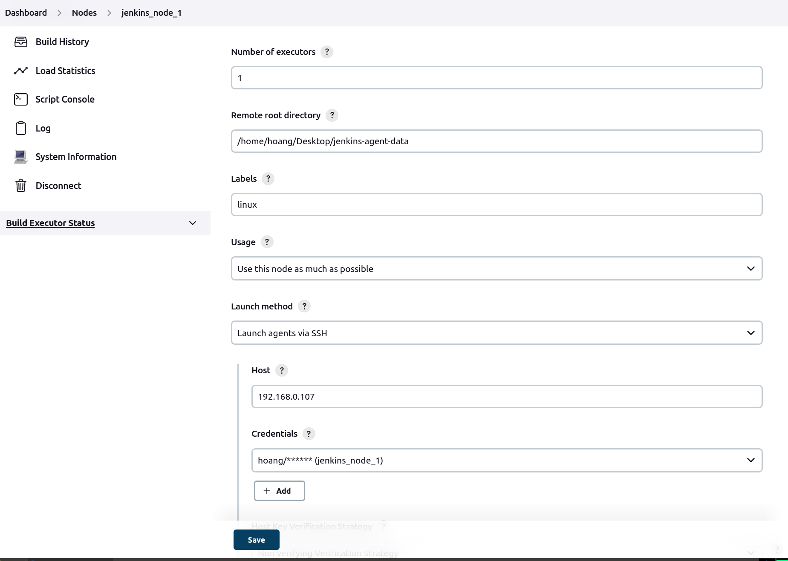
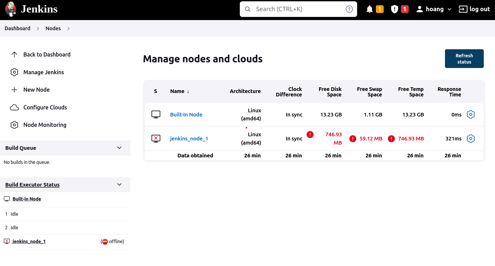
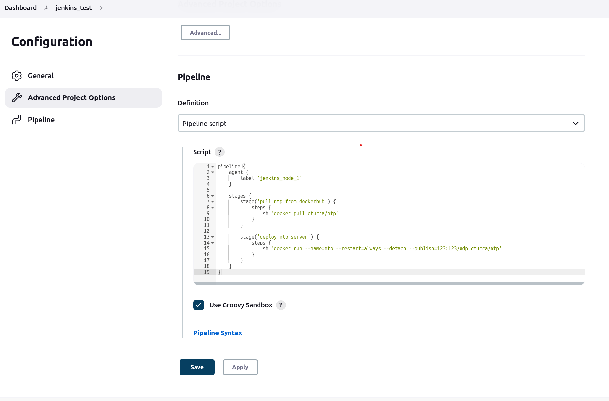
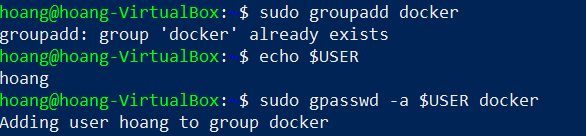
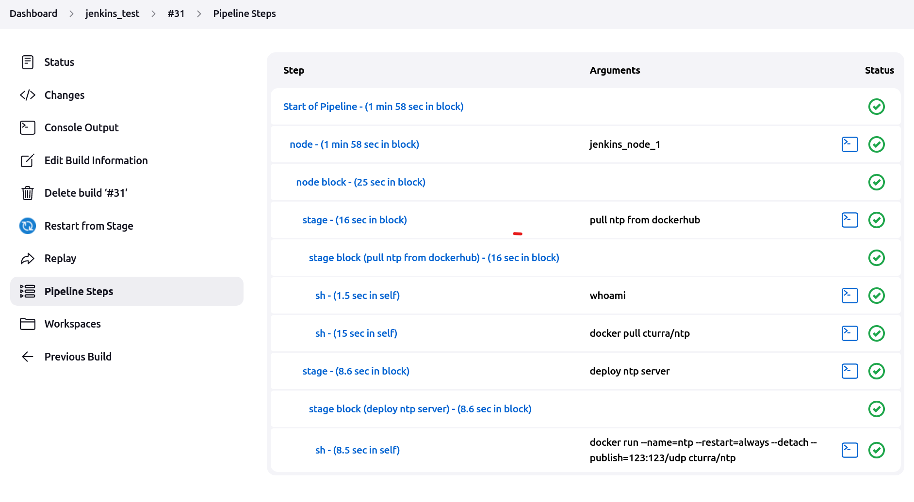
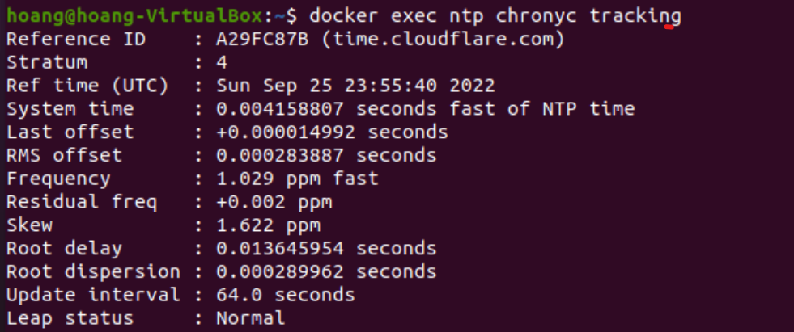

# Task 4: Jenkins Test
CI/CD Pipeline using Jenkins

## Preparation

- 2 VMs can ping to each other

## Implementation

1. Install Java 11
    
    `sudo apt install openjdk-11-jre`

2. Install Jenkins

    - Add the key to system:

        `curl -fsSL https://pkg.jenkins.io/debian-stable/jenkins.io.key | sudo tee \
        /usr/share/keyrings/jenkins-keyring.asc > /dev/null`

    - Add Jenkins apt repository entry:
    
        `echo deb [signed-by=/usr/share/keyrings/jenkins-keyring.asc] \
        https://pkg.jenkins.io/debian-stable binary/ | sudo tee \
        /etc/apt/sources.list.d/jenkins.list > /dev/null`

    - Install Jenkins

        `sudo apt-get update`

        `sudo apt-get install jenkins`

3. Add Credentials for Jenkins node

    

4. Add Jenkins node and launch

    

    

5. Create new pipeline item

    

6. Allow client to run docker under username: hoang

    

7. Run pipeline in Jenkins

    

## Troubleshooting

- Need to install exact Java version 11.
- Can't execute the `sudo su` to get root from pipeline scripts.
- Need to allow docker run under user scope to avoid the permission error.

## Verification

- Check result in client

