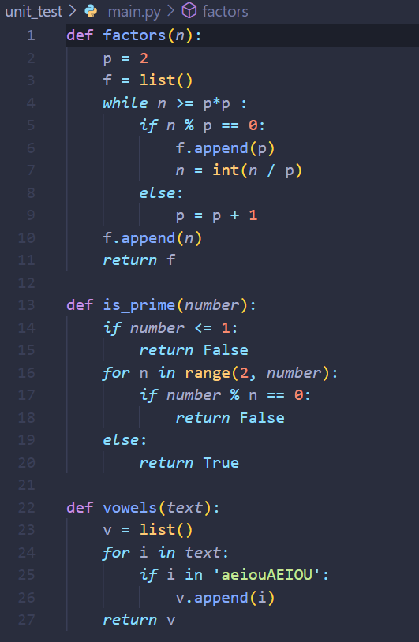
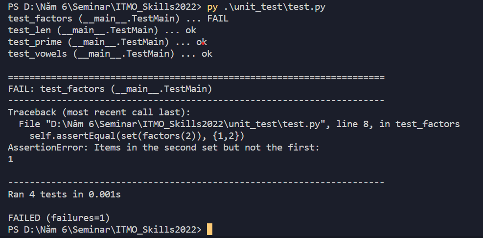

# Task 5: Unit test

Unit testing

## Preparation

- 1 VM can run python

## Implementation

1. Create main.py file with all the functions

    

2. Create test.py file with all the test cases:

    

3. Run test.py to check all the functions:

    

## Troubleshooting

- The factors is the wrong function

## Verification

